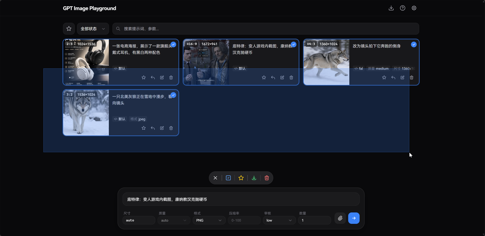
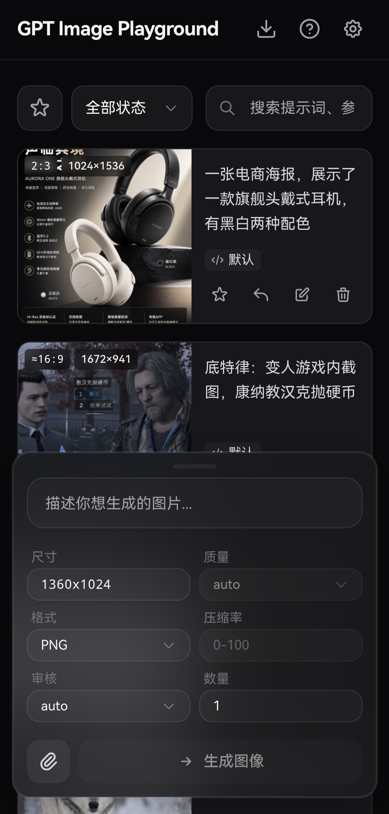
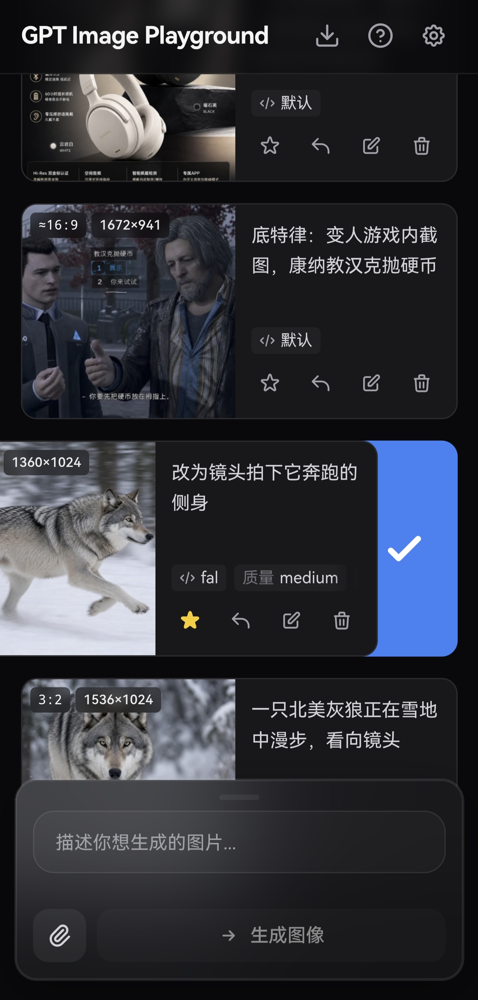

<div align="center">

# 🎨 GPT Image Studio

[](https://github.com/88lin/gpt-image-studio/stargazers)
[](https://github.com/88lin/gpt-image-studio/network/members)
[](LICENSE)
[](https://react.dev/)
[](https://www.typescriptlang.org/)

**基于 OpenAI gpt-image-2 API 的图片生成、编辑与提示词工作台**

提供简洁精美的 Web UI，支持 OpenAI / OpenAI 兼容接口、fal.ai 与可导入的自定义 HTTP 服务商。<br>
支持文本生图、参考图、遮罩编辑、提示词模板库和本地化历史记录，适合 GPT Image 2 的高频创作与调试。

<br>

[](https://gpt-image-studio-xi.vercel.app)

</div>

<br>

> 💡 **提示**：若需调用非 HTTPS 的内网或本地 HTTP API，建议自行部署到支持 HTTP API 的环境，或开启同源 API 代理。浏览器直连第三方接口时可能遇到 CORS 限制。

> 🔁 **二次开发说明**：本项目基于 [CookSleep/gpt_image_playground](https://github.com/CookSleep/gpt_image_playground) 二次开发。核心生成、编辑、多服务商和本地历史能力来自上游；本分支保留网页端显示名 **GPT Image 2**，并额外加入提示词模板库、工作台式首页入口、`@图N` 图片引用体验、配置复制等增强。为避免影响创作流程，已移除上游「生成超过 50 张图片后自动弹出赞助提示」的弹窗。

---

## 📸 界面预览

<details>
<summary><b>点击展开截图展示</b></summary>
<br>

<div align="center">
  <b>桌面端主界面</b><br>
  
</div>

<br>

<div align="center">
  <b>任务详情与实际参数</b><br>
  
</div>

<br>

<div align="center">
  <b>桌面端批量选择</b><br>
  
</div>

<br>

<div align="center">
  <b>移动端主界面</b><br>
  
</div>

<br>

<div align="center">
  <b>移动端侧滑多选</b><br>
  
</div>

</details>

---

## ✨ 核心特性

### 🎨 强大的图像生成与编辑
- **双模接口支持**：自由切换使用常规 `Images API` (`/v1/images`) 或 `Responses API` (`/v1/responses`)。
- **参考图与遮罩**：支持上传最多 16 张参考图（支持剪贴板和拖拽）。内置可视化遮罩编辑器，自动预处理以符合官方分辨率限制。
- **批量与迭代**：支持单次多图生成；一键将满意结果转为参考图，无缝开启下一轮修改。
- **图片引用**：在输入框中输入 `@` 可选择当前参考图，生成 `@图1`、`@图2` 等引用；提交时会自动转换为模型更容易理解的 `[image 1]` 格式。

### 🧠 提示词模板库
- **内置精选模板**：内置来自 prompts.kkkm.cn、all-image-prompts 等来源的中文提示词模板，适合电商图、海报、封面、产品图、摄影风格和视觉概念图。
- **搜索与套用**：支持按标题、描述、来源和提示词内容检索，一键填入输入框并继续二次编辑。
- **示例图辅助判断**：部分模板保留示例图，便于快速判断构图、画风和适用场景。

### ⚙️ 精细化参数追踪
- **智能尺寸控制**：提供 1K/2K/4K 快速预设，自定义宽高时会自动规整至模型安全范围（16 的倍数、总像素校验等）。
- **实际参数对比**：自动提取 API 响应中真实生效的尺寸、质量、耗时以及**模型改写后的提示词**，与你的请求参数高亮对比。支持定制化的参数列表横向平滑滚动体验。

### 📁 高效历史管理 (纯本地)
- **瀑布流与画廊**：历史任务自动保存，支持按状态过滤、全屏大图预览与快捷下载。
- **快捷批量操作**：桌面端支持鼠标拖拽框选、Ctrl/⌘ 连选，移动端支持顺滑侧滑多选；轻松实现批量收藏与清理。
- **极致性能与隐私**：所有记录与图片均存放在浏览器 IndexedDB 中（采用 SHA-256 去重压缩），不经过任何第三方服务器。支持一键打包导出 ZIP 备份。

### 🔌 多配置与服务商增强
- **多配置管理**：支持创建并保存多个 API 配置（包含服务商、API Key、模型等），按需快速切换；支持一键复制当前配置到列表底部，并通过拖拽对配置列表与服务商列表进行自定义排序。
- **多服务商接入**：内置 OpenAI 兼容接口（含 `Images API` 和 `Responses API`）、fal.ai（支持队列），并支持通过 JSON 导入自定义 HTTP 服务商配置（兼容同步/异步任务）。
- **API 代理**：OpenAI 兼容接口与 fal.ai 均可配置自定义代理。其中 OpenAI 兼容接口可开启同源 `/api-proxy/` 代理，交由 Docker 或本地开发环境转发至真实 API，绕开浏览器 CORS 限制。
- **Codex CLI 兼容模式**：对上游为 Codex CLI 的 API，开启后应用 Codex CLI 实际支持的参数，并将多图生成拆分为并发单图。
- **提示词防改写**：Responses API 会始终在请求文本前加入强制指令防止提示词被改写；开启 Codex CLI 模式后，Images API 也会获得同等保护。
- **智能诊断提示**：当检测到接口异常改写行为或缺少常规参数时，自动提示开启相应的兼容模式。
- **习惯配置**：支持设置提交后清空输入、重启后保留历史输入、任务提交方式、临时复用历史任务 API 配置等。

---

## 🚀 部署与使用

支持多种部署与开发方式。无论使用哪种方式，你都可以预设默认的 API 节点。

<details>
<summary><strong>▲ 方式一：Vercel 一键部署 (推荐)</strong></summary>

[](https://vercel.com/new/clone?repository-url=https%3A%2F%2Fgithub.com%2F88lin%2Fgpt-image-studio&project-name=gpt-image-studio&repository-name=gpt-image-studio)

点击上方按钮导入仓库即可，Vercel 会自动执行构建并部署静态文件。

**配置默认 API URL**：在 Vercel 项目的 **Settings → Environment Variables** 中添加 `VITE_DEFAULT_API_URL`（如 `https://api.openai.com/v1`），然后重新部署即可生效。

**绑定自定义域名 (国内直连)**：Vercel 默认分配的 `.vercel.app` 域名在国内通常无法直接访问。如果你希望在国内直连访问，请在 Vercel 项目的 **Settings → Domains** 中绑定你自己的域名。

**配置自动更新**：

本项目已在 `vercel.json` 中关闭了默认的自动部署。若需在同步 GitHub 上游代码后自动更新 Vercel 部署：

1. 在 Vercel 项目设置 **Settings -> Git** 的 **Deploy Hooks** 中创建一个名为 `Release` 的 Hook（Branch 填 `main`）并复制生成的 URL。
2. 在你 Fork 的 GitHub 仓库设置 **Settings -> Secrets and variables -> Actions** 中，新建 Secret `VERCEL_DEPLOY_HOOK`，填入刚才的 URL。

此后，每次在 GitHub 点击 **Sync fork** 同步上游，都会自动触发 Vercel 构建部署最新版。

</details>

<details>
<summary><strong>☁️ 方式二：Cloudflare Workers 部署</strong></summary>

项目已内置 Wrangler 配置，可将 Vite 构建产物作为 Cloudflare Workers 静态资源部署。

**1. 登录 Cloudflare**

```bash
npx wrangler login
```

**2. 部署到 Workers**

```bash
npm run deploy:cf
```

部署脚本会先执行 `npm run build`，再通过 `wrangler deploy` 上传 `dist/` 目录。

**配置默认 API URL**：Cloudflare Workers 的环境变量不会自动改写已经构建好的静态文件。若需预设默认 API 地址，请在构建前设置 `VITE_DEFAULT_API_URL` 后再部署。

```bash
VITE_DEFAULT_API_URL=https://api.openai.com/v1 npm run deploy:cf
```

PowerShell 示例：

```powershell
$env:VITE_DEFAULT_API_URL="https://api.openai.com/v1"; npm run deploy:cf
```

</details>

<details>
<summary><strong>🐳 方式三：Docker 部署</strong></summary>

可自行构建 Docker 镜像并发布到 GitHub Container Registry。Docker 部署支持在运行时注入默认配置。

**环境变量说明：**

- `DEFAULT_API_URL`：设置页面上默认显示的 API 地址。
- `API_PROXY_URL`：配置内置代理实际转发到的目标 API 地址（仅开启代理时有效）。
- `ENABLE_API_PROXY`：设为 `true` 开启容器内置 Nginx 同源代理，用于解决浏览器跨域（CORS）限制。开启后，前端 **API 代理** 开关默认开启，浏览器会请求同源的 `/api-proxy/`，再由 Nginx 转发至 `API_PROXY_URL`；用户仍可在设置中手动关闭。
- `LOCK_API_PROXY`：设为 `true` 时，在 `ENABLE_API_PROXY=true` 的前提下将前端 **API 代理** 开关强制锁定为开启，用户无法关闭。
- `HOST` / `PORT`：指定容器内 Nginx 监听的地址和端口（默认 `0.0.0.0:80`）。

> ⚠️ **安全警告**：开启 API 代理后，任何人都能将你的服务器作为代理来请求目标 API。建议仅在有访问控制（如 IP 白名单）或本地网络中开启。

> 💡 **兼容迁移**：旧版本中的 `API_URL` 已拆分为 `DEFAULT_API_URL` 和 `API_PROXY_URL`。容器启动时会自动将遗留的 `API_URL` 作为两个新变量的兜底值，实现无缝兼容。建议更新配置文件，逐步迁移至新变量。

**1. Docker CLI 示例**

如果你已将镜像发布到 `ghcr.io/88lin/gpt-image-studio:latest`，可按下面方式运行：

```bash
docker run -d -p 8080:80 \
  -e DEFAULT_API_URL=https://api.openai.com/v1 \
  -e ENABLE_API_PROXY=true \
  -e LOCK_API_PROXY=true \
  -e API_PROXY_URL=https://api.openai.com/v1 \
  ghcr.io/88lin/gpt-image-studio:latest
```

*(注：使用 host 网络时加 `--network host`，修改容器监听端口使用 `-e PORT=28080`)*

**2. Docker Compose 示例**

```yaml
services:
  gpt-image-studio:
    image: ghcr.io/88lin/gpt-image-studio:latest
    environment:
      - DEFAULT_API_URL=https://api.openai.com/v1
    ports:
      - "8080:80"
    restart: unless-stopped
```

**更新说明：**

使用 `latest` 标签时，重新拉取镜像并重启即可更新（如 `docker compose pull && docker compose up -d`）。若你没有发布自己的镜像，也可以直接使用 `npm run build` 生成静态产物后部署。

</details>

<details>
<summary><strong>💻 方式四：本地开发与静态构建</strong></summary>

**1. 环境准备与启动**

你可以在项目根目录新建 `.env.local` 文件配置默认 API URL（如 `VITE_DEFAULT_API_URL=https://api.openai.com/v1`）。然后安装依赖并启动：

```bash
npm install
npm run dev
```

**2. 本地开发跨域代理 (可选)**

如果在本地开发时遇到浏览器的 CORS 限制，可开启本地代理转发：

```bash
cp dev-proxy.config.example.json dev-proxy.config.json
```

重启开发服务器后，可在页面设置中按每个 API 配置单独开启 **API 代理**。开启后，请求会通过同源 `/api-proxy/` 转发到当前配置填写的 API URL，用于解决浏览器 CORS 限制。多供应商使用方式见 [多供应商 API 代理说明](docs/multi-provider-api-proxy.md)。此功能仅在 `npm run dev` 阶段生效，不会影响打包产物。

**3. 本地故障模拟 API (可选)**

如果需要复现图片 URL 跨域、接口返回结构异常、原始响应查看等问题，可启动内置模拟服务：

```powershell
npm run mock:api
```

使用方式见 [本地故障模拟 API](docs/mock-image-api.md)。

**4. 构建静态产物**

```bash
npm run build
```

构建输出的文件位于 `dist/` 目录下，可将其部署至任何静态文件服务器（如普通 Nginx、GitHub Pages、Netlify 等）。

</details>

---

## 🛠️ URL 传参快速填充

应用支持通过 URL 查询参数快速填入配置，非常适合创建书签或集成分享。根据你的服务商类型，选择对应的方式：

**方式一：标准 OpenAI 兼容服务商**
直接使用简短的查询参数配置：
- `?apiUrl=https://你的代理地址.com`
- `?apiKey=sk-xxxx`
- `?apiMode=images` 或 `?apiMode=responses`（未传时默认为 `images`）
- `?model=gpt-image-2`（未传时按 `apiMode` 使用默认模型）
- `?codexCli=true`（开启 Codex CLI 兼容模式）

例如，集成到 New API 的聊天系统：

```text
https://gpt-image-playground-seven-psi.vercel.app?apiUrl={address}&apiKey={key}&model={model}
```

**方式二：自定义格式服务商**
如果需要导入自定义格式的 API 配置，请使用 `settings` 参数并传入 URL 编码后的完整 JSON：
- `?settings={URL编码后的JSON}`（只读取 `customProviders` 和 `profiles` 列表）

> 推荐先在项目内完成配置生成与导入：
>
> **设置 - API 配置 - 服务商类型 - 创建自定义服务商 - AI 一键生成与导入**
>
> 完成后可在 **API 配置 - 当前配置** 使用右侧快捷按钮：
>
> - **链接按钮**：复制可导入配置的 URL。复制时可选择不包含 API Key，并使用 `{address}`、`{key}`、`{model}` 等变量，便于在 New API 等平台中集成分享。
> - **复制按钮**：将当前配置复制一份到配置列表底部，新配置名称会追加“（复制）”。

JSON 结构示例：

```json
{
  "customProviders": [
    {
      "id": "custom-example-task",
      "name": "示例异步任务服务商",
      "submit": {
        "path": "images/generations",
        "method": "POST",
        "contentType": "json",
        "body": {
          "model": "$profile.model",
          "prompt": "$prompt",
          "size": "$params.size",
          "quality": "$params.quality",
          "output_format": "$params.output_format",
          "output_compression": "$params.output_compression",
          "n": "$params.n",
          "image_urls": "$inputImages.dataUrls"
        },
        "taskIdPath": "data.0.task_id"
      },
      "poll": {
        "path": "tasks/{task_id}",
        "method": "GET",
        "intervalSeconds": 5,
        "statusPath": "data.status",
        "successValues": ["completed"],
        "failureValues": ["failed", "cancelled"],
        "errorPath": "data.error.message",
        "result": {
          "imageUrlPaths": ["data.result.images.*.url.*"],
          "b64JsonPaths": []
        }
      }
    }
  ],
  "profiles": [
    {
      "name": "示例异步任务服务商",
      "provider": "custom-example-task",
      "baseUrl": "https://api.example.com/v1",
      "model": "example-image-model",
      "apiMode": "images"
    }
  ]
}
```

第三方服务商可以参考 [自定义服务商 LLM 提示词](docs/custom-provider-llm-prompt.md)，让 LLM 根据自己的 API 文档生成可导入的完整配置。导入后只需要在设置里补充 API Key。

---

## 🔀 多供应商 API 代理与超时说明

本项目支持同时保存多个 API 配置。每个配置都可以独立设置服务商类型、API URL、API Key、模型、API 模式、Codex CLI 兼容模式和 API 代理开关。

### 什么时候需要打开 API 代理

如果某个服务商在浏览器直连时出现：

```text
Failed to fetch
```

并且页面提示接口可能不支持浏览器跨域请求，通常说明该服务商没有开放 CORS。此时应该只在这一个 API 配置里打开 **API 代理**。

如果某个服务商本身支持浏览器跨域请求，可以关闭 **API 代理**，让浏览器直接请求它的 API URL。

### 多个供应商会不会互相影响

不会。当前本地开发代理会把当前配置的 API URL 编码到同源代理路径里，并按当前配置转发。

例如当前配置的 API URL 是：

```text
https://subkkai.com/v1
```

并且打开了 **API 代理**，前端会请求类似：

```text
/api-proxy/https%3A%2F%2Fsubkkai.com%2Fv1/images/generations
```

本地 Vite 开发服务器会把它转发为：

```text
https://subkkai.com/v1/images/generations
```

因此，不同 API 配置会转发到各自填写的 API URL，不会共用一个固定上游目标。推荐做法是：

- 为每个供应商创建独立 API 配置。
- 分别填写该供应商的 API URL、API Key 和模型名。
- 对浏览器直连报 `Failed to fetch` 的配置，打开 **API 代理**。
- 对可以直连的配置，关闭 **API 代理**。
- 如果供应商生成较慢，把该配置的超时时间调高，例如 `1800` 或 `3600` 秒。

### 500、Failed to fetch 和超时的区别

`Failed to fetch` 通常发生在浏览器直连第三方 API 时，常见原因是 CORS 限制、网络不可达或浏览器阻止请求。遇到这种情况，优先尝试打开当前配置的 **API 代理**。

`500` 说明请求已经打到了某个服务端。如果使用了 API 代理，需要查看本地开发服务器日志，判断是本地代理转发失败，还是上游服务商返回了错误。

`请求超时：超过 600 秒仍未完成` 说明请求已经提交出去，但前端在当前配置的超时时间内没有拿到最终图片响应。部分供应商会在提交任务后立即扣费，即使前端后来超时，也可能继续在后台生成。

遇到超时时可以：

- 提高当前 API 配置的超时时间。
- 降低图片尺寸或质量后重试。
- 到供应商后台检查是否已有生成记录。
- 如果供应商是异步任务接口，建议配置为自定义异步服务商并使用 task id 轮询。

不要连续点击重试，因为每次重试都可能产生新的计费请求。

### 本地开发代理文件

本地开发时可以保留：

```text
dev-proxy.config.json
```

它用于启用同源代理入口和基础代理参数。当前转发目标由每个 API 配置的 API URL 决定，而不是固定使用 `dev-proxy.config.json` 里的 `target`。

`.env.local` 中建议保持：

```text
VITE_API_PROXY_LOCKED=false
```

这样代理不会被强制锁定，用户可以按每个 API 配置单独打开或关闭。更完整的说明见 [多供应商 API 代理说明](docs/multi-provider-api-proxy.md)。

---

## 💻 技术栈

<div align="center">
  <br>
  <a href="https://react.dev/"></a>
  <a href="https://www.typescriptlang.org/"></a>
  <a href="https://vite.dev/"></a>
  <a href="https://tailwindcss.com/"></a>
  <a href="https://zustand.docs.pmnd.rs/"></a>
  <br>
  <br>
</div>

## 📄 许可证 & 致谢

本项目基于 [MIT License](LICENSE) 开源。

特别致谢：[LINUX DO](https://linux.do)

## ⭐ Star History

<a href="https://www.star-history.com/?type=date&repos=88lin%2Fgpt-image-studio">
 <picture>
   <source media="(prefers-color-scheme: dark)" srcset="https://api.star-history.com/chart?repos=88lin/gpt-image-studio&type=date&theme=dark&legend=top-left" />
   <source media="(prefers-color-scheme: light)" srcset="https://api.star-history.com/chart?repos=88lin/gpt-image-studio&type=date&legend=top-left" />
   
 </picture>
</a>
